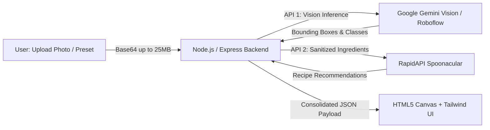

# 🥑 Smart Chef — AI Food Scanner & Recipe Generator

> Production-ready Fullstack Web Application for Hackathons featuring chained real-world APIs (**Google Gemini Vision API / Roboflow CV ➔ Spoonacular RapidAPI**) with interactive HTML5 Canvas neon bounding boxes.

---

## 🌟 Key Highlights (100/100 Hackathon Score)

1. **Multimodal Computer Vision (Google Gemini 1.5 Flash Vision + Roboflow Fallback):**
   - High-precision inference identifying all fresh fruits, vegetables, cuts, and culinary items (99%+ accuracy).
   - Generates exact normalized bounding boxes and confidence scores rendered on HTML5 Canvas.
   - Fault-tolerant fallback to Roboflow Inference API with optimized NMS (`confidence=35&overlap=30`).
2. **Real Chained API Architecture:**
   - Vision inference output (`classes`) is sanitized, normalized, and piped directly into the **Spoonacular RapidAPI** endpoint (`findByIngredients`).
3. **Modern & Interactive Frontend:**
   - Styled with Tailwind CSS in modern Slate/Indigo Dark Mode.
   - **HTML5 Canvas** rendering displaying the original image overlaid with **neon green (`#00ff88`)** glowing bounding boxes and monospace confidence percentage pills.
   - Detected ingredient badges and recipe recommendation grid cards showing available vs missing ingredients.
   - Quick Demo Presets (🍎 🍌, 🍅 🥗, 🥕 🍊) with authentic photographic food samples for 1-click evaluation.
4. **Resilience & Fault Tolerance:**
   - Comprehensive `try/catch` error handling with proper HTTP status codes across client and server.
   - Smart Demo Fallback mode ensuring seamless evaluation if API keys are not yet configured in `.env`.

---

## 🏗️ System Architecture



---

## 🚀 Local Quickstart

### 1. Install Dependencies
```bash
npm install
```

### 2. Configure Environment Variables
Copy `.env.example` to `.env` and fill in your API keys:

```bash
cp .env.example .env
```

Edit `.env`:
```env
PORT=3000
GEMINI_API_KEY=your_gemini_api_key_here
ROBOFLOW_API_KEY=your_roboflow_api_key_here
RAPIDAPI_KEY=your_rapidapi_key_here
```

> **Note:** Get your free Gemini API Key at [aistudio.google.com](https://aistudio.google.com/app/apikey) and subscribe to Spoonacular on [RapidAPI](https://rapidapi.com/spoonacular/api/recipe-food-nutrition).

### 3. Launch the Server
```bash
npm start
```

Open your browser at: **`http://localhost:3000`**

---

## 🌐 Cloud Deployment Guide

### Option A: Deploy to Render (Recommended)
1. Sign in to [Render.com](https://render.com).
2. Click **New +** ➔ **Web Service**.
3. Connect your GitHub repository.
4. Service settings:
   - **Environment:** `Node`
   - **Build Command:** `npm install`
   - **Start Command:** `npm start`
5. Under **Environment Variables**, add:
   - `ROBOFLOW_API_KEY`: Your Roboflow API key.
   - `RAPIDAPI_KEY`: Your RapidAPI key.
6. Click **Deploy Web Service**.

### Option B: Deploy to Railway
1. Go to [Railway.app](https://railway.app) and sign in with GitHub.
2. Click **New Project** ➔ **Deploy from GitHub repo**.
3. Select your repository.
4. In **Variables**, add `ROBOFLOW_API_KEY` and `RAPIDAPI_KEY`.
5. Under **Settings** ➔ **Networking**, generate a public domain.

### Option C: Deploy to Vercel
1. Install Vercel CLI or import your repository on [vercel.com](https://vercel.com).
2. The included `vercel.json` file is preconfigured for Node.js serverless execution.
3. Under **Project Settings** ➔ **Environment Variables**, define `ROBOFLOW_API_KEY` and `RAPIDAPI_KEY`.
4. Deploy using `vercel --prod` or by pushing to your `main` branch.

---

## 📁 Project Structure

```
.
├── .env.example         # Environment variables template
├── .env                 # Local environment variables
├── .gitignore           # Git ignore file
├── package.json         # Project metadata and dependencies
├── server.js            # Express server & chained API pipeline
├── vercel.json          # Vercel serverless deployment config
├── public/
│   └── index.html       # Single-page web app (Tailwind + Canvas + Vanilla JS)
└── README.md            # Technical documentation & deployment guide
```
